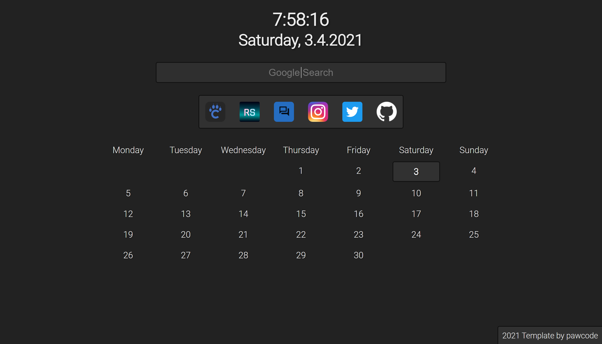
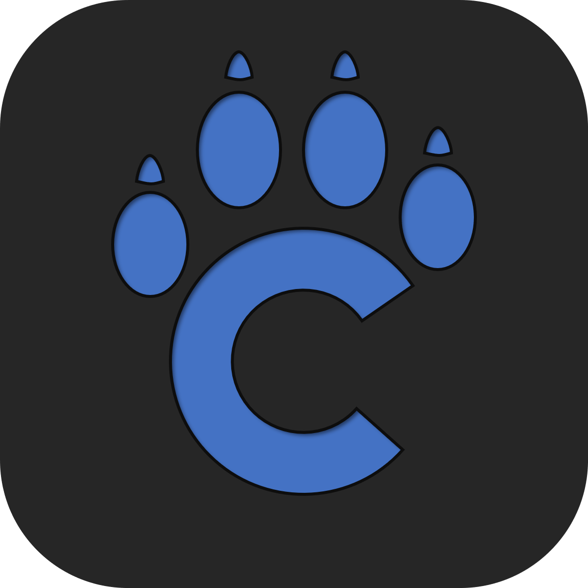

# Dashboard | Your Personal Startpage
## General
This Dashboard is a personal start page for the browser.
It's divided into different modules so that even beginners can easily get started with web programming. Just download the code and open the `index.html` file with your browser.

> 
> Screenshot


## Modules
* Clock
  * Time
  * Date
* Google Search
* Bookmarks list
* Calendar


## How to personalize
### Changing the order
Every module has it's own `<article>`-tag. You can easily swap the order of the modules by changing the order in the source code of the `index.html` file.

### Adding own bookmarks
In the module **Links** you can find the block `<div class=weblinks>`. The block contains all the bookmarks. Every bookmark is built by the following structure:
```html
<a href="https://pawcode.de" target="_blank" title="pawcode.de">
 
</a>
```
Element | Function
------- | --------
`<a>` | **Anchor tag** (Link)
`href="..."` | Links to the website
`target="_blank"` | Ensures that the page opens in a new browser tab
`title="..."` | Displays a text when the mouse hovers over the icon
`` | **Image tag** (Icon)
`src="..."` | Path to the icon _(can be local or weblink)_
`alt` | Displays a text when the icon file was not found

### Changing the theme
The style of the dashboard is divided into two different files in the `css` folder:
* `Layout.css`
* `Design.css`

You only have to worry about the design as the layout generally stays the same.
The first element in the design file is called `:root`. Here you can find all the colors and other useful values.
```css
:root {
  --color-background: #222;
  --color-text: #eee;
  --color-shadow: #111;

  ...
}
```
#### Example
You want to change the color of the background to a light grey.
Just set the value of `--color-background` to `#bbb` and you are good to go.
